<p align = "center" draggable="false" >
</p>

## <h1 align="center" id="heading">Session 15: Build & Serve an A2A Endpoint for Our LangGraph Agent</h1>

| 🤓 Pre-work | 📰 Session Sheet | ⏺️ Recording     | 🖼️ Slides        | 👨‍💻 Repo         | 📝 Homework      | 📁 Feedback       |
|:-----------------|:-----------------|:-----------------|:-----------------|:-----------------|:-----------------|:-----------------|

# A2A Protocol Implementation with LangGraph

This session focuses on implementing the **A2A (Agent-to-Agent) Protocol** using LangGraph, featuring intelligent helpfulness evaluation and multi-turn conversation capabilities.

## 🎯 Learning Objectives

By the end of this session, you'll understand:

- **🔄 A2A Protocol**: How agents communicate and evaluate response quality

## 🧠 A2A Protocol with Helpfulness Loop

The core learning focus is this intelligent evaluation cycle:

```mermaid
graph TD
    A["👤 User Query"] --> B["🤖 Agent Node<br/>(LLM + Tools)"]
    B --> C{"🔍 Tool Calls<br/>Needed?"}
    C -->|"Yes"| D["⚡ Action Node<br/>(Tool Execution)"]
    C -->|"No"| E["🎯 Helpfulness Node<br/>(A2A Evaluation)"]
    D --> F["🔧 Execute Tools"]
    F --> G["📊 Tavily Search<br/>(Web Results)"]
    F --> H["📚 ArXiv Search<br/>(Academic Papers)"]  
    F --> I["📄 RAG Retrieval<br/>(Document Search)"]
    G --> B
    H --> B
    I --> B
    E --> J{"✅ Is Response<br/>Helpful?"}
    J -->|"Yes (Y)"| K["🏁 END<br/>(Task Complete)"]
    J -->|"No (N)"| L{"🔄 Loop Count<br/>< 10?"}
    L -->|"Yes"| B
    L -->|"No"| K
    
    style A fill:#1e3a5f,stroke:#ffffff,stroke-width:3px,color:#ffffff
    style B fill:#4a148c,stroke:#ffffff,stroke-width:3px,color:#ffffff
    style C fill:#0d47a1,stroke:#ffffff,stroke-width:3px,color:#ffffff
    style D fill:#1b5e20,stroke:#ffffff,stroke-width:3px,color:#ffffff
    style E fill:#e65100,stroke:#ffffff,stroke-width:3px,color:#ffffff
    style F fill:#2e7d32,stroke:#ffffff,stroke-width:3px,color:#ffffff
    style G fill:#00695c,stroke:#ffffff,stroke-width:3px,color:#ffffff
    style H fill:#4527a0,stroke:#ffffff,stroke-width:3px,color:#ffffff
    style I fill:#283593,stroke:#ffffff,stroke-width:3px,color:#ffffff
    style J fill:#2e7d32,stroke:#ffffff,stroke-width:3px,color:#ffffff
    style K fill:#c62828,stroke:#ffffff,stroke-width:3px,color:#ffffff
    style L fill:#f57c00,stroke:#ffffff,stroke-width:3px,color:#ffffff
```



# Build 🏗️

Complete the following tasks to understand A2A protocol implementation:

## 🚀 Quick Start

```bash
# Setup and run
./quickstart.sh
```

```bash
# Start LangGraph server
uv run python -m app
```

```bash
# Test the A2A Serer
uv run python app/test_client.py
```

### 🏗️ Activity #1:

Build a LangGraph Graph to "use" your application.

Do this by creating a Simple Agent that can make API calls to the 🤖Agent Node above through the A2A protocol. 

### ❓ Question #1:

What are the core components of an `AgentCard`?

##### ✅ Answer:

An `AgentCard` is a standardized metadata structure that describes an agent's capabilities and API endpoints. The core components include:

1. **Basic Identification:**
   - `name`: The agent's human-readable name
   - `version`: Version of the agent implementation
   - `description`: Optional description of what the agent does

2. **API Endpoints:**
   - `send_message_url`: Endpoint for sending non-streaming messages
   - `send_streaming_message_url`: Endpoint for streaming message responses
   - Well-known paths (e.g., `/.well-known/agent.json`) for card discovery

3. **Capability Flags:**
   - `supports_streaming`: Whether the agent can stream responses
   - `supports_authenticated_extended_card`: Whether the agent provides an extended card with additional capabilities for authenticated users
   - `supports_multi_turn`: Whether the agent maintains conversation context

4. **Protocol Information:**
   - `protocol_version`: The A2A protocol version the agent implements
   - `supported_message_types`: Types of messages the agent can handle (text, images, etc.)

5. **Authentication & Security:**
   - Authentication methods supported
   - Token requirements for extended card access
   - CORS and security policies

6. **Extended Capabilities (in authenticated extended cards):**
   - Available tools and their descriptions
   - Rate limits and usage quotas
   - Advanced features specific to authenticated users
   - Model configurations and parameters

The AgentCard serves as a "contract" between agents, enabling discovery and interoperability in the A2A protocol ecosystem.

<br />

### ❓ Question #2:

Why is A2A (and other such protocols) important in your own words?

##### ✅ Answer:

The A2A (Agent-to-Agent) protocol is critically important for several reasons:

**1. Standardization & Interoperability:**
Just as HTTP standardized web communication, A2A standardizes agent communication. Without protocols like A2A, every agent system would have its own custom API format, making integration a nightmare. A2A ensures that agents from different developers, companies, or frameworks can seamlessly communicate.

**2. Composability & Specialization:**
A2A enables building complex AI systems from specialized agents. Instead of one monolithic agent trying to do everything, you can have:
- A research agent specialized in academic papers
- A web search agent for current events
- A domain-specific RAG agent for internal documents
- An orchestration agent that coordinates these specialists

Each agent can excel at its specific task while delegating to others when needed.

**3. Scalability & Distribution:**
A2A allows agents to be deployed independently and communicate over networks. This means:
- Agents can run on different servers/services
- Load can be distributed across multiple instances
- Specialized agents can use specialized hardware (e.g., GPU-heavy agents)
- Systems can scale horizontally by adding more agent instances

**4. Security & Access Control:**
The protocol provides a structured way to handle authentication, authorization, and rate limiting. Extended agent cards can expose different capabilities to different users, enabling secure multi-tenancy.

**5. Quality Control Through Evaluation:**
A2A's helpfulness evaluation loop demonstrates how agents can assess and refine their own outputs or those of other agents. This meta-level reasoning enables quality control and iterative improvement of responses.

**6. Future-Proofing:**
As AI agents become more prevalent, having established protocols like A2A prevents fragmentation and vendor lock-in. It's the foundation for an ecosystem where agents can be mixed, matched, and replaced based on capability rather than proprietary API compatibility.

**7. Transparency & Observability:**
The AgentCard mechanism provides built-in discoverability - agents can advertise their capabilities, limitations, and requirements. This makes it easier to understand what an agent can do, monitor its behavior, and debug issues in complex multi-agent systems.

In essence, A2A is to AI agents what REST/HTTP is to web services - a common language that enables a rich ecosystem of interoperable, specialized, and composable intelligent systems. Without such protocols, we'd be stuck in isolated silos of incompatible agent implementations.

<br /><br />

<details>
<summary>🚧 Advanced Build 🚧 (OPTIONAL - <i>open this section for the requirements</i>)</summary>

Use a different Agent Framework to **test** your application.

Do this by creating a Simple Agent that acts as different personas with different goals and have that Agent use your Agent through A2A. 

Example:

"You are an expert in Machine Learning, and you want to learn about what makes Kimi K2 so incredible. You are not satisfied with surface level answers, and you wish to have sources you can read to verify information."
</details>

## 📁 Implementation Details

For detailed technical documentation, file structure, and implementation guides, see:

**➡️ [app/README.md](./app/README.md)**

This contains:
- Complete file structure breakdown
- Technical implementation details
- Tool configuration guides
- Troubleshooting instructions
- Advanced customization options

# Ship 🚢

- Short demo showing running Client

# Share 🚀

- Explain the A2A protocol implementation
- Share 3 lessons learned about agent evaluation
- Discuss 3 lessons not learned (areas for improvement)

# Submitting Your Homework

## Main Homework Assignment

Follow these steps to prepare and submit your homework assignment:
1. Create a branch of your `AIE8` repo to track your changes. Example command: `git checkout -b s15-assignment`
2. Complete the activity above
3. Answer the questions above _in-line in this README.md file_
4. Record a Loom video reviewing the Simple Agent you built for Activity #1 and the results.
5. Commit, and push your changes to your `origin` repository. _NOTE: Do not merge it into your main branch._
6. Make sure to include all of the following on your Homework Submission Form:
    + The GitHub URL to the `15_A2A_LANGGRAPH` folder _on your assignment branch (not main)_
    + The URL to your Loom Video
    + Your Three Lessons Learned/Not Yet Learned
    + The URLs to any social media posts (LinkedIn, X, Discord, etc.) ⬅️ _easy Extra Credit points!_

### OPTIONAL: 🚧 Advanced Build Assignment 🚧
<details>
  <summary>(<i>Open this section for the submission instructions.</i>)</summary>

Follow these steps to prepare and submit your homework assignment:
1. Create a branch of your `AIE8` repo to track your changes. Example command: `git checkout -b s015-assignment`
2. Complete the requirements for the Advanced Build
3. Record a Loom video reviewing the agent you built and demostrating in action
4. Commit, and push your changes to your `origin` repository. _NOTE: Do not merge it into your main branch._
5. Make sure to include all of the following on your Homework Submission Form:
    + The GitHub URL to the `15_A2A_LANGGRAPH` folder _on your assignment branch (not main)_
    + The URL to your Loom Video
    + Your Three Lessons Learned/Not Yet Learned
    + The URLs to any social media posts (LinkedIn, X, Discord, etc.) ⬅️ _easy Extra Credit points!_
</details>